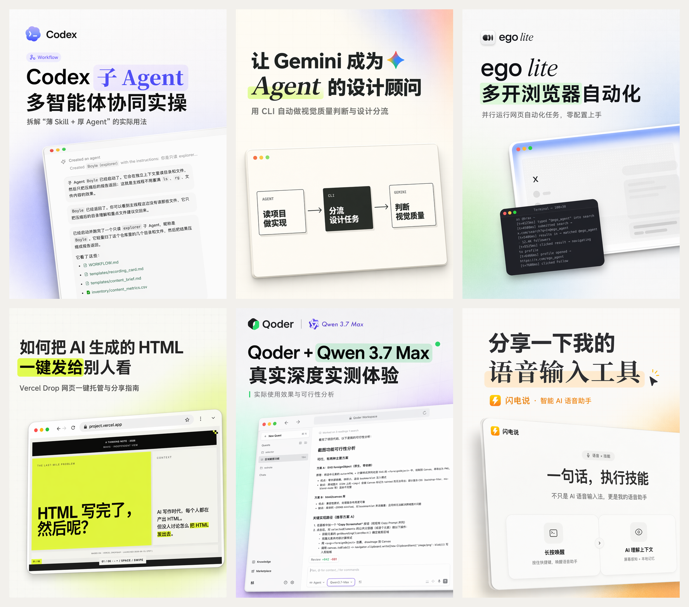
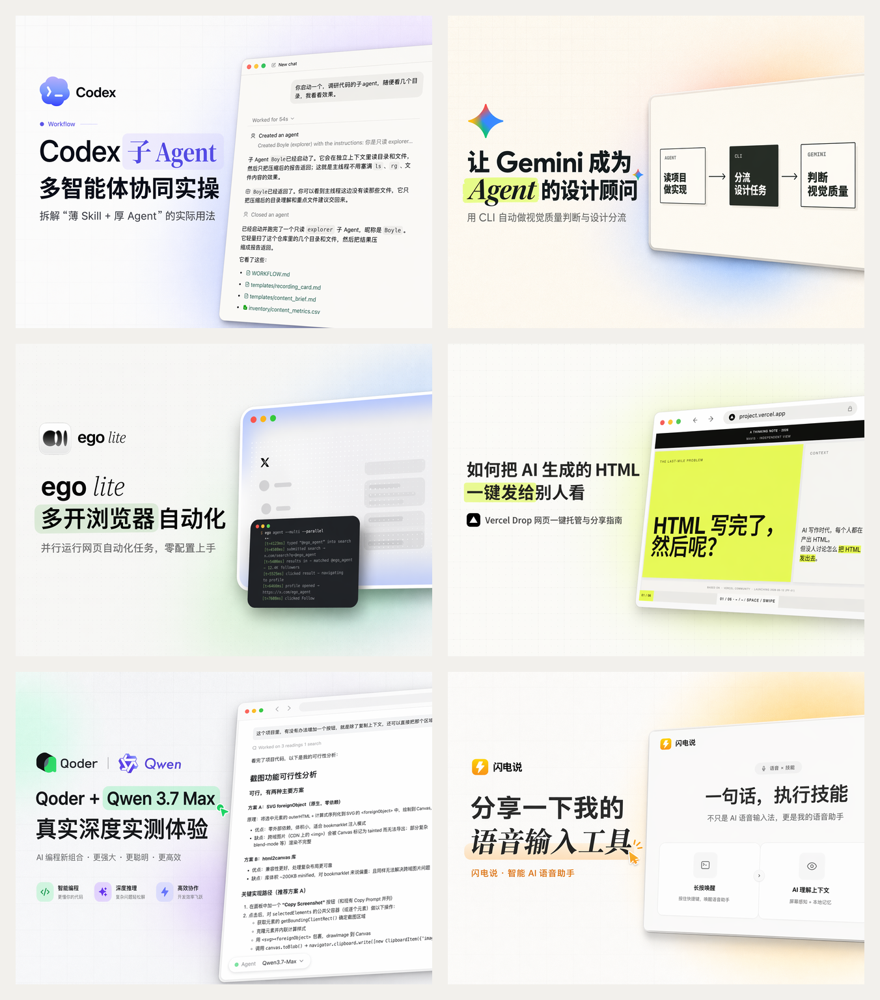
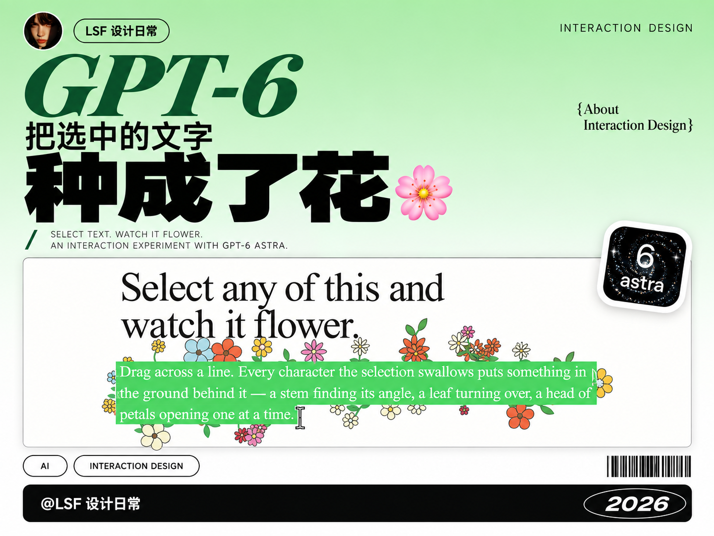
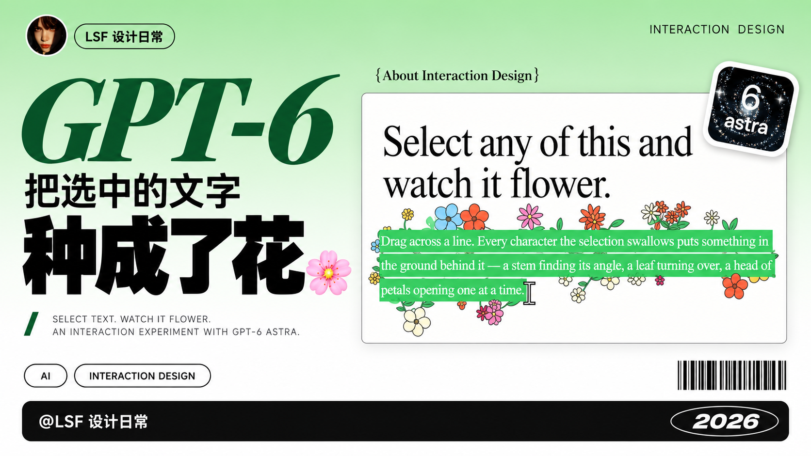

# oil-cover

基于真实视频内容生成三种画幅的封面，支持选帧分析、标题设计和可选创作者头像合成。

AI 教程方向是 **真实屏幕证据 + Apple-like 产品视觉 + 清晰标题 + 无人物干净构图**；另提供可选的设计分享方向：标题主次对比、单色渐变、作者署名和 Logo 贴纸。两种风格均整图生成，不靠本地贴字拼图。

> 作者：oil 欧呦（[@oil-oil](https://github.com/oil-oil)）

## 封面示例

<p align="center">
  
</p>
<p align="center">
  
</p>

## 选择风格：AI 教程 / 设计分享

开始一组封面时先选择风格；已经说明风格或只在修改同一组图片时不重复问。原有 AI 教程的脚本、默认视觉和可选头像合成保持原样。

设计分享适合网页、视觉作品和交互设计。它采用单一纯色到白色（或深色画面对应黑色）的渐变背景、具有字体和字重对比的标题、左上角圆形作者头像、截图右上角 Logo 贴纸，以及底部署名和年份。

```text
用 $oil-cover 做设计分享风格，发小红书。
使用这个视频，生成 3:4、4:3、16:9 三版。
```

此风格目前仅支持 **Agent 自主模式 + 支持参考图的内置图像工具**。头像会作为参考图传给图像工具；原版脚本的透明头像仍只在本地合成。若已设为脚本模式，Agent 会说明限制并取得本次使用自主模式的选择，不静默修改默认配置。

### 设计分享案例：文字开花

案例由 [LSF 设计日常 / @leishifu666](https://github.com/leishifu666) 提供，来源为作者的 [GPT-6 文字开花视频](https://www.xiaohongshu.com/explore/6aacae260000000011037fdc)。选择视频 12 秒处的真实画面，放大绿色选区、花朵和光标；贴纸参考 [OpenAI 官方 GPT-6 Astra 模型页](https://developers.openai.com/api/docs/models/gpt-6-astra) 的图标。

<p align="center"></p>
<p align="center"></p>
<p align="center"></p>

实际输出 1086×1448、1448×1086、1672×941（第三张近似 16:9，未裁切）。截图、图标和头像由图像工具参考素材整图生成，细节会重绘。示例资料不作为安装后的默认账号或头像，不代表官方合作或背书。

### 按平台保存账号和头像

首次选择设计分享时，提供发布平台及对应的准确名称和头像；小红书、公众号、抖音等可分别保存，也可明确要求共用。已保存的平台直接复用，只补缺失项。头像复制到本机资料目录，聊天缓存清理后仍可使用。

本地管理脚本需要 **Python 3.10+ 与 Pillow**（不改变原生成脚本的运行要求）：

```bash
python -m pip install -r requirements.txt
python scripts/creator_profiles.py set --platform xiaohongshu --name "你的账号名称" --avatar "头像.png"
python scripts/creator_profiles.py set --platform wechat --name "你的公众号" --avatar "公众号头像.png" --signature "你的公众号"
python scripts/creator_profiles.py list
python scripts/creator_profiles.py show --platform xiaohongshu
```

资料默认保存在 `~/.oil-cover/creators/`，可以通过 `OIL_COVER_CREATOR_HOME` 指定其他本机目录。该工具不登录平台、不发布内容；资料不写入 Skill 或公共仓库。详细规则见 [作者资料说明](references/creator-profiles.md) 与 [设计分享流程](references/design-share-flow.md)。不同平台署名不同则分别生成；三种基础画幅不涵盖所有平台发布位置，有额外规格时按要求适配。

## 特点

- **视频选帧**：本地扫描和评分筛出高清候选帧，再由多模态模型按语义选择，不上传整段视频。
- **完整视觉规范**：`references/cover-rules.md` 覆盖构图、背景层、字体标题、点缀、自动质检和提示词骨架。
- **默认三画幅**：并行出小红书 `3:4` 竖版、B 站首页主封面 `4:3` 横版和个人空间伴随版 `16:9` 横版。
- **产品 Logo 自动匹配**：内置 Claude / Codex / Cursor / Gemini / GitHub 等常用 AI 产品 Logo。

已指定的封面标题会锁定到分析与各画幅提示词中。有标题或主题时，Logo 匹配不再回退到字幕里的次要品牌；没有可信资产时使用产品名和真实界面建立识别。新增参考资产见 [资产列表](references/product-assets.md)。

## 两种执行模式

| | 脚本模式（默认） | Agent 自主执行 |
| --- | --- | --- |
| 怎么跑 | 跑 `scripts/generate_oil_cover.py` | 执行的 Agent 自己读 SOP 端到端完成 |
| 选帧 / 分析 | ZenMux 上的 Gemini | Agent 自身多模态视觉 |
| 生图 | ZenMux `gpt-image-2` | Agent 自带图像生成工具（图生图） |
| 依赖 | Python + ffmpeg + ZenMux key | 仅需带生图工具的 Agent（如 Codex 内置 `image_gen`） |
| 适合 | 高保真、可复现 | 零外部依赖、零 key |

模式偏好记在 `~/.oil-cover/config.json`，设一次以后不再问。自主模式完整流程见 [`references/agent-native-flow.md`](references/agent-native-flow.md)。

## 安装

使用支持的 Skill 安装器：

```bash
npx skills add oil-oil/oil-cover
```

运行时使用当前 Skill 目录中的脚本与资源，不要求安装到某个宿主的固定目录。`--api-key` 明文命令参数已停用；环境变量或已有私有凭据文件仍可读取。

## 用法（脚本模式）

```bash
python3 "<Skill绝对目录>/scripts/generate_oil_cover.py" \
  --video "<视频路径>" \
  --title "<标题或主题>" \
  --topic "<补充背景>"
```

截图 / 关键帧输入：

```bash
python3 "<Skill绝对目录>/scripts/generate_oil_cover.py" \
  --image "<截图路径>" \
  --logo "<可选 Logo 路径>" \
  --title "<标题>"
```

默认并行出 `3:4` + `4:3` + `16:9`。完整参数（取帧策略、`--dry-run`、`--skip-generate` 等）见 [`SKILL.md`](SKILL.md)。

### 配置 ZenMux key（仅脚本模式需要）

脚本调用 ZenMux（Gemini 分析 + `gpt-image-2` 生图），需要 API key。按优先级读取：

1. `ZENMUX_API_KEY` 环境变量
2. `--api-key-file` 指定的文件；未指定时使用用户配置中的 `api_key_file`，最后回退到 `~/.config/oil-cover/zenmux_api_key`

日常使用优先配置环境变量或外部密钥文件，不把密钥写进 Skill、提示词或 Git 仓库。

### 依赖

- Python 3.9+
- `ffmpeg`（视频抽帧）
- 一个 ZenMux 账号与 API key

## 用法（Agent 自主执行）

在带图像生成工具的 Agent（如 Codex）里触发，Agent 会读 [`references/agent-native-flow.md`](references/agent-native-flow.md) 自己完成选帧、分析、出图，**不需要 ZenMux key**。生图那一步在 Codex 里用其系统级 `imagegen` 的内置 `image_gen` 工具（图生图）。

## 本地测试

```bash
python3 -m pip install -r requirements.txt
python3 -m unittest discover -s tests -p 'test_*.py'
```

测试通过主入口验证 Logo 选择、标题锁定和 sidecar 写入，并验证新资料管理脚本的多平台隔离、更新保留、头像归档与损坏配置保护；不调用外部 API 或生成图片。

## 目录结构

```
SKILL.md                        技能主说明（两种模式 + 参数）
scripts/generate_oil_cover.py   脚本模式实现
references/
  cover-rules.md                完整视觉规范
  agent-native-flow.md          Agent 自主执行 SOP
  impact-tech-cover-style.md    可选的冲击型科技封面风格
  product-assets.md             产品 Logo 资产清单
assets/product-logos/           内置 AI 产品 Logo
```

## 商标与第三方资产

`assets/product-logos/` 内的产品 Logo 为各自公司商标，仅作封面参考资产，**不在本项目 MIT 许可范围内**，收录于此不代表任何合作或背书。来源与归属见 [NOTICE](NOTICE)。

## License

[MIT](LICENSE) © 2026 oil 欧呦

## API Key 配置页面

首次使用外部服务时，可以在本机配置页亲自填写 Key；已有配置会复用，密钥存入系统凭据库。只为实际使用的外部服务配置；纯本地处理不需要 Key。页面需要 Node.js 22.18+ 与可用的系统凭据服务，业务运行仍使用原依赖。

安装、状态检查、打开页面和带凭据运行的完整入口见[配置说明](references/api-key-setup.md)。页面保存与业务读取已经接通；不把 Key 发进聊天，也不自动迁移旧文件。
